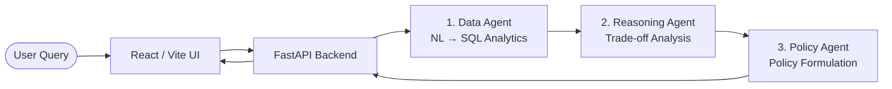

# CityPulse — AI Civic Decision Copilot 🏛️🤖

[](https://github.com/MitraKin/AtlasAI/actions/workflows/deploy.yml)
[](https://cloud.google.com/run)
[](https://fastapi.tiangolo.com/)
[](https://vitejs.dev/)

**CityPulse** is an advanced AI-powered civic decision copilot designed to empower urban planners, municipal leaders, and citizens. By integrating multi-agent reasoning with real-time demographic and complaint datasets, CityPulse analyzes urban zones, predicts infrastructure needs, and formulates equitable resource allocation policies.

---

## 🌐 Live Application URLs (Google Cloud Run)

CityPulse is deployed and running live on **Google Cloud Run** within Google Cloud's **$0/month Free Tier** architecture (configured with auto-scaling to zero instances when idle).

| Service | Live URL | Description |
| :--- | :--- | :--- |
| **🎨 Frontend UI** | [https://citypulse-frontend-929818377595.us-central1.run.app](https://citypulse-frontend-929818377595.us-central1.run.app) | Interactive Civic Dashboard & AI Copilot interface |
| **⚙️ Backend API** | [https://citypulse-backend-929818377595.us-central1.run.app](https://citypulse-backend-929818377595.us-central1.run.app) | FastAPI REST API endpoints & Agent Orchestrator |
| **📖 API Docs (Swagger)**| [https://citypulse-backend-929818377595.us-central1.run.app/docs](https://citypulse-backend-929818377595.us-central1.run.app/docs) | Interactive OpenAPI / Swagger documentation |

---

## 🧠 Multi-Agent AI Architecture

CityPulse utilizes a specialized **3-Stage Agentic Pipeline** powered by **Google Gemini 2.0 Flash**:
1. **📊 Data Agent:** Translates natural language civic queries into structured SQL analytics over demographic and municipal complaint datasets.
2. **⚖️ Reasoning Agent:** Evaluates multi-dimensional trade-offs (e.g., Equity vs. Efficiency vs. Urgency) across urban zones using multi-criteria decision analysis.
3. **📋 Policy Agent:** Synthesizes actionable policy recommendations, funding allocations, and executive summaries with transparent scoring metrics.



---

## 🚀 Local Development Guide

### Prerequisites
* **Node.js:** v20.x or higher
* **Python:** v3.12 or higher
* **Google Gemini API Key:** [Get a free API key from Google AI Studio](https://aistudio.google.com/)

---

### 1. Backend Setup (FastAPI)

1. Navigate to the `backend` directory and create a virtual environment:
   ```bash
   cd backend
   python -m venv .venv
   # On Windows (PowerShell):
   .\.venv\Scripts\Activate.ps1
   # On macOS/Linux:
   source .venv/bin/activate
   ```

2. Install Python dependencies:
   ```bash
   pip install -r requirements.txt
   ```

3. Create a local environment file `.env` inside `backend/`:
   ```env
   CITYPULSE_ENV=development
   CITYPULSE_GEMINI_MODEL=gemini-2.0-flash
   CITYPULSE_GEMINI_API_KEY=your_actual_gemini_api_key_here
   CITYPULSE_LOG_LEVEL=DEBUG
   CITYPULSE_CORS_ORIGINS=http://localhost:5173,http://localhost:3000
   CITYPULSE_DATA_DIR=../data/datasets
   ```

4. Start the backend development server:
   ```bash
   uvicorn app.main:app --host 0.0.0.0 --port 8000 --reload
   ```
   *The backend API will be available at `http://localhost:8000`.*
   *API documentation will be available at `http://localhost:8000/docs`.*

---

### 2. Frontend Setup (React + Vite)

1. Open a new terminal window, navigate to `frontend/`, and install dependencies:
   ```bash
   cd frontend
   npm ci
   ```

2. Create a local environment file `.env.local` inside `frontend/`:
   ```env
   VITE_API_URL=http://localhost:8000
   ```

3. Start the Vite development server:
   ```bash
   npm run dev
   ```
   *The interactive UI will open at `http://localhost:5173`.*

---

## ☁️ Cloud Deployment & Automated CI/CD

CityPulse features a state-of-the-art, **zero-secret DevOps pipeline** built with **GitHub Actions** and **Google Cloud Run**.

### 1. Free-Tier Cloud Run Architecture
* **Zero Idle Cost:** Configured with `--min-instances=0` so containers scale down completely to zero when not receiving HTTP requests.
* **Source-Based Cloud Build:** Uses `gcloud run deploy --source .` to compile container images directly in Google Cloud Build (120 free build minutes/day), removing the need for local Docker daemons.
* **Build-Time Environment Injection:** The GitHub Actions pipeline dynamically captures the live backend Cloud Run URL and injects it into `.env.production` during the frontend build step, baking the API connection directly into the static JavaScript bundle served by Nginx.

### 2. Automated GitHub Actions Pipeline (`.github/workflows/deploy.yml`)
Whenever code is pushed to `main` or `master`, the automated workflow executes:
1. **Workload Identity Federation (WIF):** Authenticates securely with Google Cloud via OIDC token exchange—**no long-lived Service Account JSON keys or passwords are stored in GitHub Secrets.**
2. **Deploy Backend:** Compiles and deploys the FastAPI container to Cloud Run, attaching the Gemini API key from Google Secret Manager.
3. **Link Frontend:** Retrieves the backend URL dynamically, generates `.env.production`, and deploys the Nginx/React frontend container to Cloud Run.
4. **Lock Down CORS:** Automatically updates the backend's allowed CORS origins to strictly match the newly deployed frontend URL.

---

## 📁 Project Structure

```text
AtlasAI/
├── .github/workflows/
│   └── deploy.yml          # Automated CI/CD pipeline for Google Cloud Run
├── backend/
│   ├── app/
│   │   ├── agents/         # Data, Reasoning, and Policy AI Agents
│   │   ├── api/v1/         # FastAPI REST endpoints & routers
│   │   ├── repositories/   # SQLite and data repository abstractions
│   │   ├── services/       # Gemini AI service & core business logic
│   │   ├── config.py       # Pydantic settings & CORS parsing
│   │   └── main.py         # FastAPI application entrypoint
│   └── requirements.txt    # Python dependencies
├── frontend/
│   ├── src/
│   │   ├── components/     # Reusable UI components (Dashboard, Chat, Cards)
│   │   ├── pages/          # Landing, Dashboard, and Ask Copilot pages
│   │   ├── services/       # API client communicating with Cloud Run backend
│   │   └── types/          # TypeScript domain interfaces
│   ├── Dockerfile          # Multi-stage Docker build (Node.js build → Nginx serve)
│   ├── nginx.conf          # Nginx server configuration (Port 8080, Gzip, Caching)
│   └── package.json        # Node.js dependencies & scripts
├── data/datasets/          # Demo civic datasets (CSV & SQLite db)
├── Dockerfile              # Root Dockerfile for source-based backend Cloud Run deploy
├── .gcloudignore           # Exclusions for backend Cloud Build uploads
└── README.md               # Project documentation
```

---

## 📄 License
This project is open-source and available under the MIT License. Built with ❤️ for smarter, more equitable cities.
